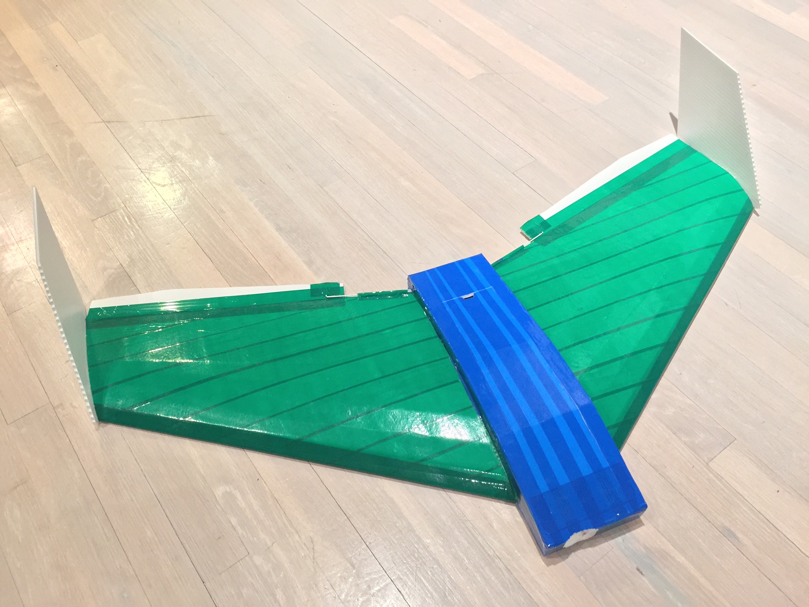
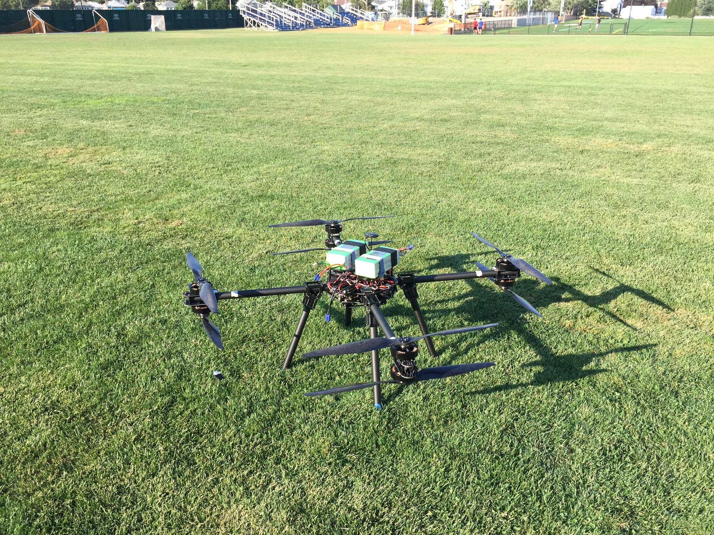
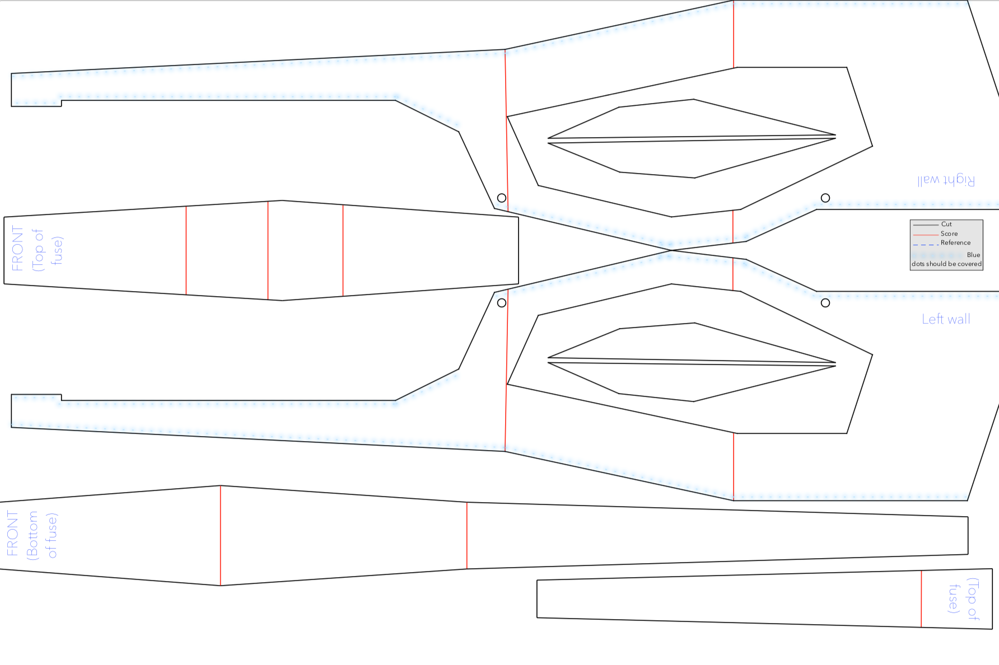
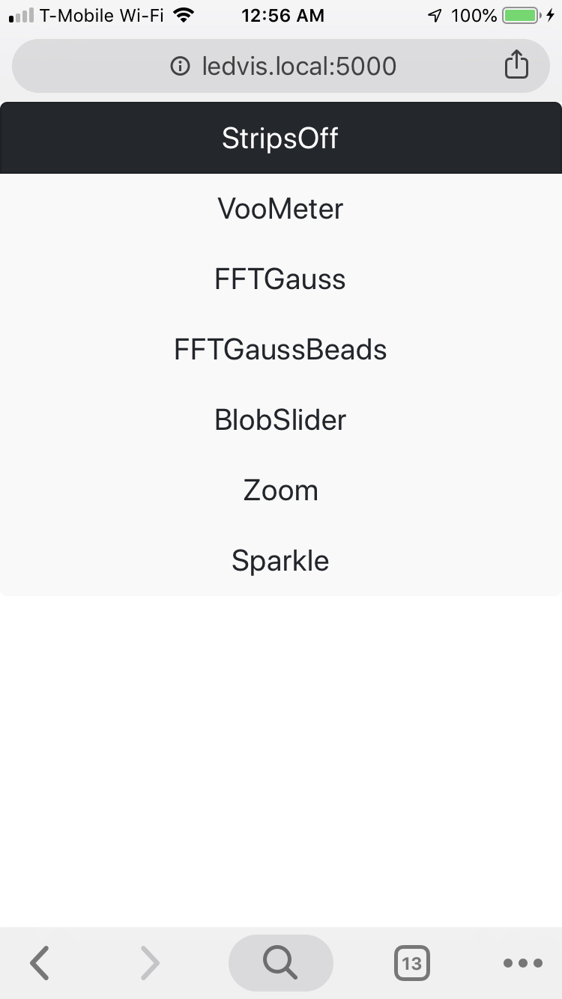
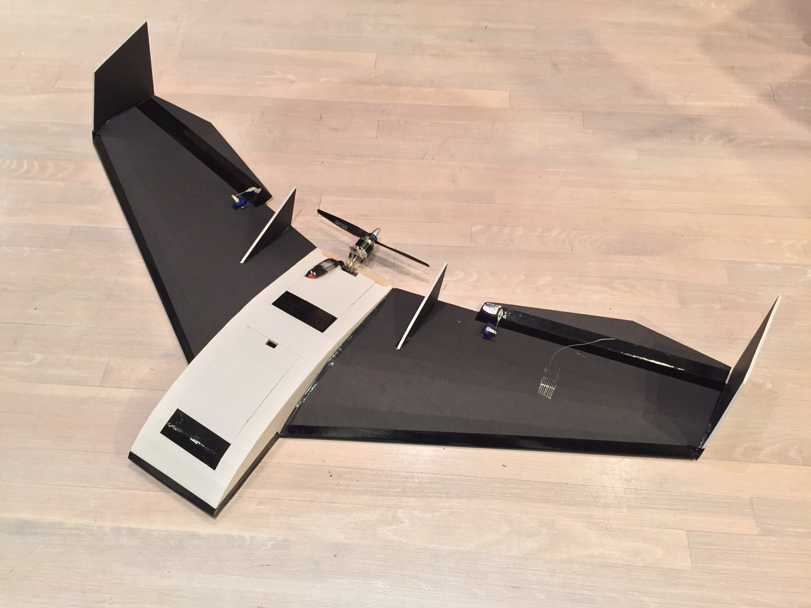
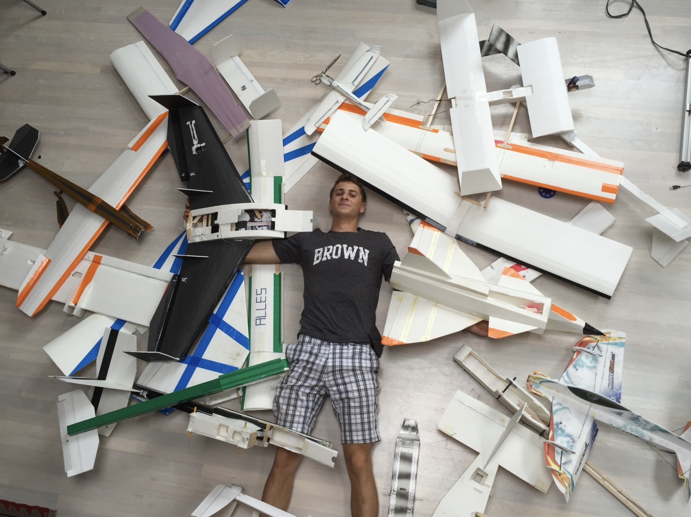
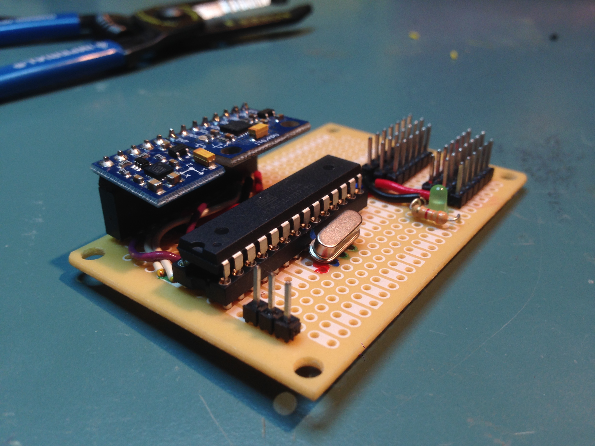
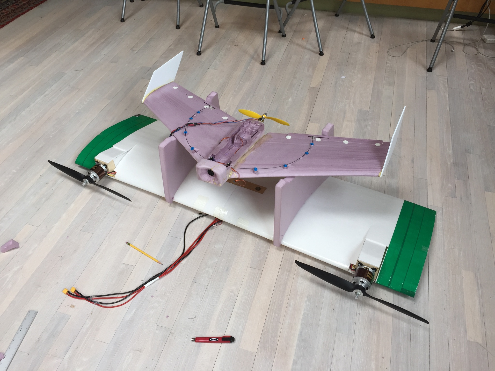

# Projects by Izzy Brand
Here's a smattering of things I've made. For every project listed below, it was either an individual project, or I was the leader of the team. There is so much more than I could include in this portfolio.

For better formatting and higher resolution, visit the online version at [https://izzybrand.github.io/portfolio/](https://izzybrand.github.io/portfolio/)

### PiDrone and Robotics Course, 2017-2018

I developed a Raspberry Pi based drone. The drone uses a downward facing camera to localize. The entire flight controller stack is implemented in python using ROS. I Head TAed an introductory robotics course at Brown University in Fall 2017 in which every student built and programmed a drone. The course is running again this Fall, 2018.

  
  

[github](https://github.com/h2r/pidrone_pkg) | [IRoS Paper](http://h2r.cs.brown.edu/wp-content/uploads/pidrone18.pdf) | [2017 Course Website](http://cs.brown.edu/courses/cs1951r/website_2017/)

---

### High altitude autonomous glider, 2018

I scratch built a flying wing glider equipped with a Pixhawk, a Raspberry Pi, and two cameras. I used a high altitude weather balloon to drop the glider from 10,000m and programmed it to fly autonomously to a target GPS coordinate and land. Initially I used a quadcopter to drop the glider for low altitude testing.

  
  
  
  

[github](https://github.com/IzzyBrand/spaceplane) | [Video of flight](https://www.youtube.com/watch?v=q10gKcguXW0)

---

### Deep Q-Network Experiment, 2018

This little 3D-printed robot was an experiment in deep RL. I implemented a DQN with experience replay, and trained this robot to avoid obstacles without any simulation. Backprop handled on offboard GPU, forward pass on the onboard raspberry pi. After about 16 hours the robot was consistently able to avoid obstacles.

  
  

[github](https://github.com/IzzyBrand/ReAI_explorerBot) | [Training progress video](https://www.youtube.com/watch?v=emgjqfE0E44)

---

### Active stabilization for rockets, 2018

We developed a flight computer and 3D printed nosecone for apogee detection, parachute deployment, telemetry and active stabilization for small rockets. We also built a 2D simulator for tuning the PID controller before testing the rocket. The first prototype was destroyed by a parachute failure, so a rebuild and more testing is required.

  
  
  

[github](https://github.com/openrocketryinitiative/carlson)

---

### Lunadrop Autonomous Drone Delivery, 2017

lunadrop is a comprehensive drone delivery system. Users visit our web app to place an order and select one of our designated delivery locations. A drone flies autonously from the hub to the selected location, descends to deliver the package, and returns to the hub. In addition to the aircraft and LTE-equipped onboard computer, we built a server and implemented user and internal web apps for ordering and deploying the fleet.

  
  
  

[github](https://github.com/IzzyBrand/dro.ne) | [Demo video](https://www.youtube.com/watch?v=Rt-q0L54g0c)

---
### Assistive Rangefinder for the Blind, 2017

After my grandfather blinded himself, I built this device to act like a cane. It used an ultrasonic distance sensor and would make a subtle noise to indicate how close he was to obstacles.

  
  

---

### Electric Longboard, 2016-2018

I built an electric longboard to commute to work and school. Top speed is ~20mph, range ~10mi. The deck is CNCed. The board is controlled via a linear potentiometer in a 3D printed grip. I've been riding this board for 3 years and roughly 300 miles.

  
  

---

### Heavy Lift X8, 2015

I designed and built a large X8 multirotor for Above Summit LLC. It was specced to lift a 15 pound gimbal payload for 25 minutes.

  
  

[Maiden flight video](https://www.youtube.com/watch?v=EVqrgPChW-E)

---

### Particle based lifelike system, 2019

This a particle system that runs in browser. Interactions between different types of particles yields emergent lifelike behavior

  
  
  

[github](https://github.com/IzzyBrand/particleLife) | [Website](https://izzybrand.github.io/particleLife/)

---

### The Fish, 2014

I designed this plane to be easy to build and fly. The lower center of gravity and polyhedtral makes the plane return to level without any pilot input. I published plans and an instructional video online, and about 20 people have sent me videos of their own Fishes!

  
  
  

[Build video and flight demo](https://www.youtube.com/watch?v=kobJpBQO3hs) | [Writeup](https://www.flitetest.com/articles/the-fish-a-scratch-built-slow-flier)

---

### Generated tree designs, 2018

SVG line-art generated with python. I want to laser engrave these on wood.

  
  

[github](https://github.com/IzzyBrand/python_svg_art)

---

### Rocket onboard computer for Apogee detection, 2017

We built this onboard computer for data logging and apogee detection on rockets (in order to deploy a parachute). In addition to a gyroscope and accelerometer, we included a microphone because we were curious if we could use the sound of rushing wind to improve apogee detection. This computer was replaced by a Raspberry Pi 0 in 2018.

  
  
  

[github](https://github.com/openrocketryinitiative/carlson)

---

### LED Music Visualizer, 2018

Raspberry Pi music visualizer written in python. Uses an ADC to sample the audio stream at 3.6kHz. FFT for responding to frequency. Flask webserver allows users to switch between visualization modes.

  
  
  

[github](https://github.com/IzzyBrand/ledvis)

---

### Lots and lots of rocket motors, 2016-2018

I prepared 100s of pounds of solid rocket fuel and tested hundred of rockets motors. We were perfecting our recipe, preparation procedure, and nozzle and chamber geometry.

  
  
  

[Thrust test data](https://github.com/openrocketryinitiative/motors) | [Video of 42.2lb thrust test](https://www.youtube.com/watch?v=pj9L2oc2jA4) | [Video of catastrophic chamber failure](https://www.youtube.com/watch?v=wenWCb-TPto)

---

### 3D printed rockets, 2017

We designed 3D-printable components rockets. All the models are parameterized, so they can be used to build many different sizes of rockets.

  
  

---

### PonderBot, 2016

Twitter bot that makes frequent cryptic posts wondering about the universe and making contact with _them_. Sometimes _they_ respond.

  

[Twitter](https://twitter.com/ponderthem?lang=en)

---

### Panda Flying Wing, 2014

Homemade flying wing equipped with APM2.5 autopilot. Flight time 35+ minutes.

  
  
  

[Slow Motion Launch Video](https://www.youtube.com/watch?v=obun7-xxfmE) | [Autonomous Flight to 1km](https://www.youtube.com/watch?v=9jJ9ODU21fM)

---

### Voronoi Lamps, 2017

3D printed LED lamps

  

---

### Lots and lots of (mostly flying) things, pre 2016

Designed and built from scratch

  
  
  
  
  
  
  
  
  
  
  
  
  
  
  
  
  
  
  
  
  
  
  
  
  
  
  
  
  
  
  
  

---
